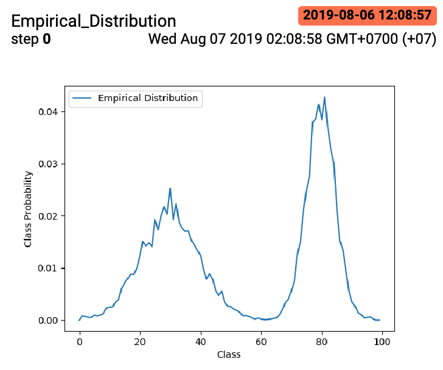
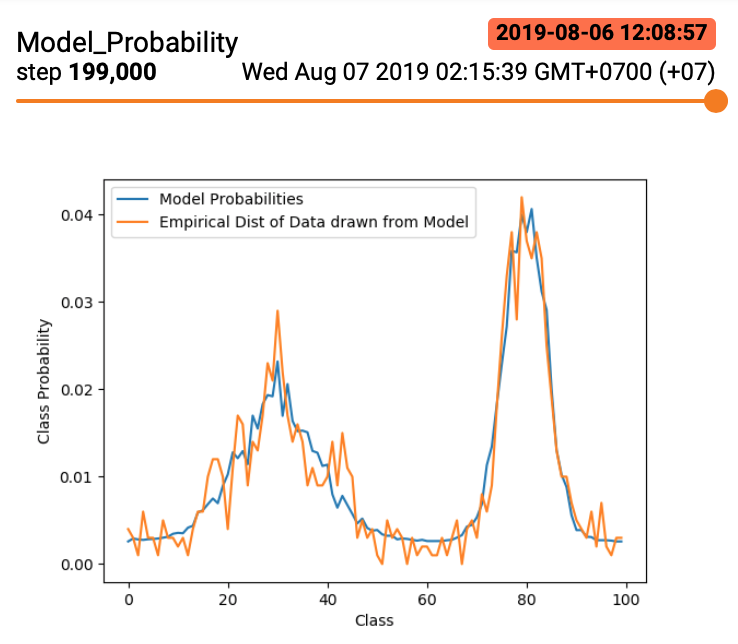

# Commands

To run the code for the warmup homework, from the root directory of this repo, do

```
python -m hw1.qns_1.warmup
```

# Results

The following image illustrates the empirical distribution
of the dataset. The x-axis indicates the class index and the y-axis
indicates the empirical probability of that class index.



The following image illustrates the performance of the
trained model. We can see that we have managed to fit the
true empirical distribution. The learnt probability for each
class matches the empirical distribution. If we sample from the model,
the empirical distribution of the sampled dataset roughly
matches the empirical distribution of the true dataset.



# Learning Points

1. A simple method to ensure there are no serious bugs is to look at the log probability of the validation set. If that is going up, then there is no serious bug.

2. However, the log probability of the validation set does not tell us how well the learnt model has fit the grouth truth distribution.

3. To do so, we can plot the probabilities that the model assigns to each class in case each datapoint is assigned to a discrete class. If the probabilities match the empirical distribution of the dataset, then
we can conclude the learnt model has fit the ground truth distribution, assuming the empirical distribution of the dataset matches the grouth truth distribution.
